<div align="center">

# Proxy.rs
Proxy.rs is a high-speed proxy tool built with Rust, featuring two main functionalities: scraper and checker.

</div>

## Preview


## Installation and Usage

- Install Rust and Cargo.
- Install Git.
- Clone the Proxy.rs repository by running the following command in your terminal:
  ```bash
  git clone https://github.com/zevtyardt/proxy.rs.git
  ```
- Navigate to the cloned repository directory:
  ```bash
  cd proxy.rs
  ```
- Run `cargo run` to build and execute Proxy.rs.

## Examples

#### find
Find and show 10 HTTP(S) proxies from EU (European Union) with the high level of anonymity:
```bash
$ proxy-rs find --types HTTP HTTPS -l 10 --levels High --countries EU
```



## Currently Under Development

The following features are currently being worked on:

- Implementing proxy DNSBL (Domain Name System Blacklist) checking for enhanced security.
- Improving the speed of the proxy checker for faster validation.
- Added more providers

## Contribution

Contributions to Proxy.rs are welcome! Here's how you can contribute:

- Fork this repository.
- Clone the forked repository to your local machine.
- Create a new branch for your changes.
- Implement your enhancements and commit them.
- Push the branch to your GitHub repository.
- Open a pull request in this repository, describing your changes and why they should be merged.

## License

Proxy.rs is licensed under the MIT License. See the [LICENSE](https://github.com/zevtyardt/proxy.rs/blob/main/LICENSE) file for further details.
