<div align="center">

# Proxy.rs
Proxy.rs is a high-speed proxy tool built with Rust, featuring three main functionalities: scraper, checker and serve (beta).

</div>

## What's New

- **Improved Performance**: Experience a remarkable **300% increase in performance**. Searching and checking a single proxy now only takes 3-5 seconds.
- **Reduced Memory Consumption**: Enjoy a more optimized memory usage with a **35% reduction**. The tool now operates efficiently, requiring only ±125 MB of memory.
- **New Feature: Serve**: Run a local proxy server directly from proxy-rs (beta). Seamlessly host your own proxy server for enhanced flexibility and control.

## Preview


## Features
- High-speed performance: Built with Rust for optimal speed.
- Support protocols: HTTP(S), SOCKS4/5. Also CONNECT method to ports 80 and 25 (SMTP)
- Version update notification.
- Work as a proxy server that distributes incoming requests to external proxies. With automatic proxy rotation.
- Proxies may be filtered by type, anonymity level, country.
- Automatically removes duplicate proxies.
- Is asyncronous.

## Installation

- Install Rust and Cargo.
- Install Git.
- Clone this repository by running the command:
  ```bash
  git clone https://github.com/zevtyardt/proxy.rs.git
  ```
- Navigate to the cloned repository directory:
  ```bash
  cd proxy.rs
  ```
- Run `cargo install --path .` to install.

or install directly using the command

```bash
cargo install --git https://github.com/zevtyardt/proxy.rs
```

## Usage

```
Usage: proxy-rs [OPTIONS] <COMMAND>
```

**Commands**
- `grab`: Find proxies without performing any checks.
- `find`: Find and check proxies.

**Options**
- `--max-conn <MAX_CONN>`: The maximum number of concurrent checks of proxies. Default: 200.
- `-t, --timeout <TIMEOUT>`: Time in seconds before giving up. Default: 8.
- `--log <LOG_LEVEL>`: Logging level. Default: warn. Possible values: debug, info, warn, error.

## Examples

### find

Find and show 10 HTTP(S) proxies from ID (Indonesia) with the high level of anonymity:
```bash
proxy-rs find --types HTTP HTTPS -l 10 --levels High --countries ID
```


**Options**
- `--types <TYPES>...`: Type(s) (protocols) to check for proxy support. Possible values: HTTP, HTTPS, SOCKS4, SOCKS5, CONNECT:80, CONNECT:25.
- `--files <FILES>...`: Path to the file with proxies. If specified, it is used instead of providers.
- `--levels <LEVELS>...`: Level(s) of anonymity (for HTTP only). By default, any level. Possible values: Transparent, Anonymous, High.
- `--max-tries <MAX_TRIES>`: The maximum number of attempts to check a proxy. Default: 1.
- `--support-cookies`: Flag indicating that the proxy must support cookies.
- `--support-referer`: Flag indicating that the proxy must support referer.
- `-c, --countries <COUNTRIES>...`: List of ISO country codes where the proxies should be located.
- `-l, --limit <LIMIT>`: The maximum number of working proxies. Default: 0.
- `-f, --format <FORMAT>`: The format in which the results will be presented. Default: default. Possible values: default, text, json.
- `-o, --outfile <OUTFILE>`: Save found proxies to a file. By default, the output is displayed on the console.

### grab

Find and save to a file 10 ID proxies (without a check):
```bash
proxy-rs grab --countries ID --limit 10 --outfile ./proxies.txt
```


**Options**
- `-c, --countries <COUNTRIES>...`: List of ISO country codes where the proxies should be located.
- `-l, --limit <LIMIT>`: The maximum number of working proxies. Default: 0.
- `-f, --format <FORMAT>`: The format in which the results will be presented. Default: default. Possible values: default, text, json.
- `-o, --outfile <OUTFILE>`: Save found proxies to a file. By default, the output is displayed on the console.

## Currently Under Development

The following features are currently being worked on:

- Implementing proxy DNSBL (Domain Name System Blacklist) checking for enhanced security.
- Improving the speed of the proxy checker for faster validation.
- Added more providers
- Implement redirect handling in the proxy server.
- 

## Contribution

Contributions to Proxy.rs are welcome! Here's how you can contribute:

- Fork this repository.
- Clone the forked repository to your local machine.
- Create a new branch for your changes.
- Implement your enhancements and commit them.
- Push the branch to your GitHub repository.
- Open a pull request in this repository, describing your changes and why they should be merged.

## License

Proxy.rs is licensed under the MIT License. See the [LICENSE](https://github.com/zevtyardt/proxy.rs/blob/main/LICENSE) file for further details.
